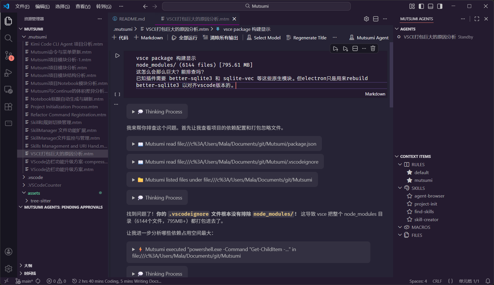
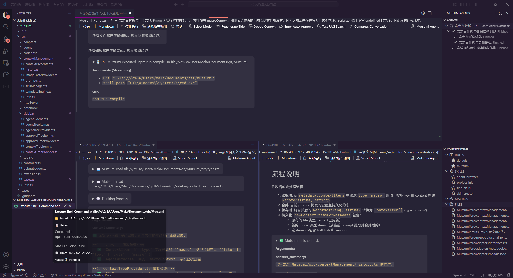
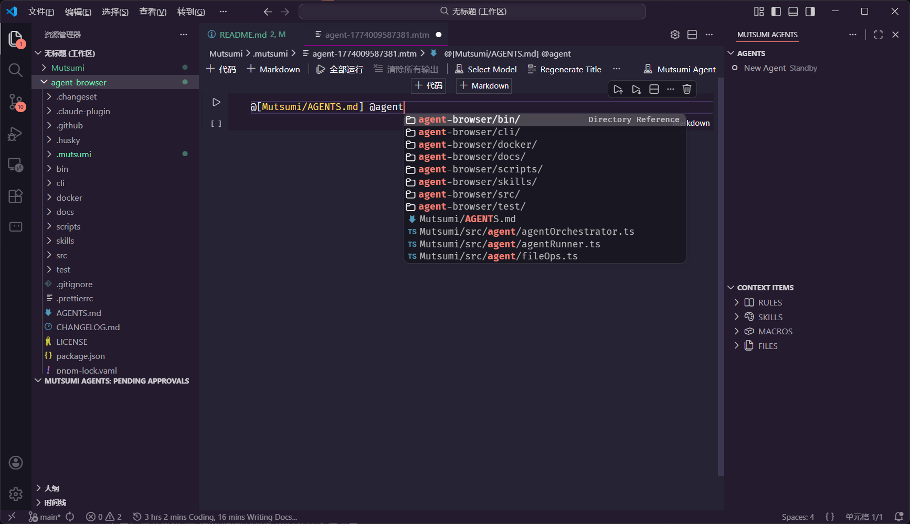
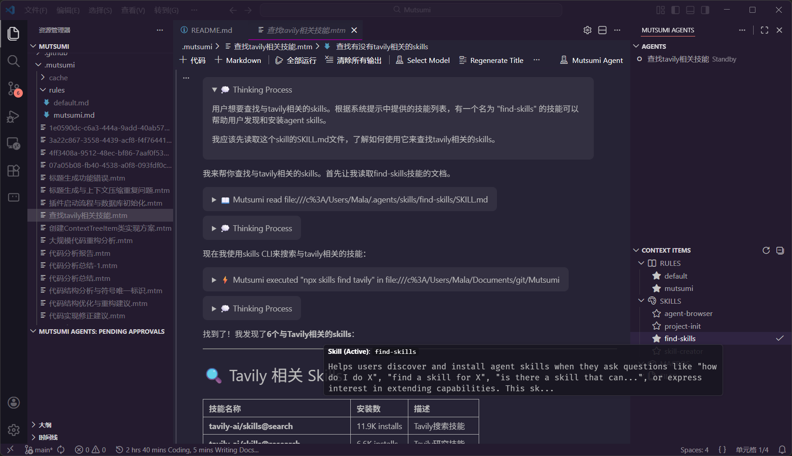
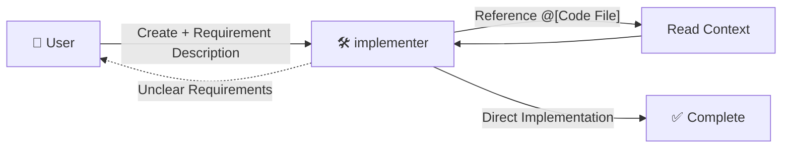
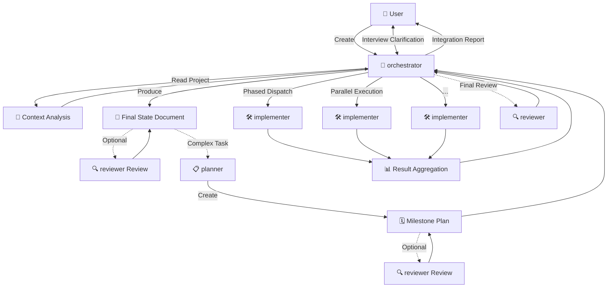
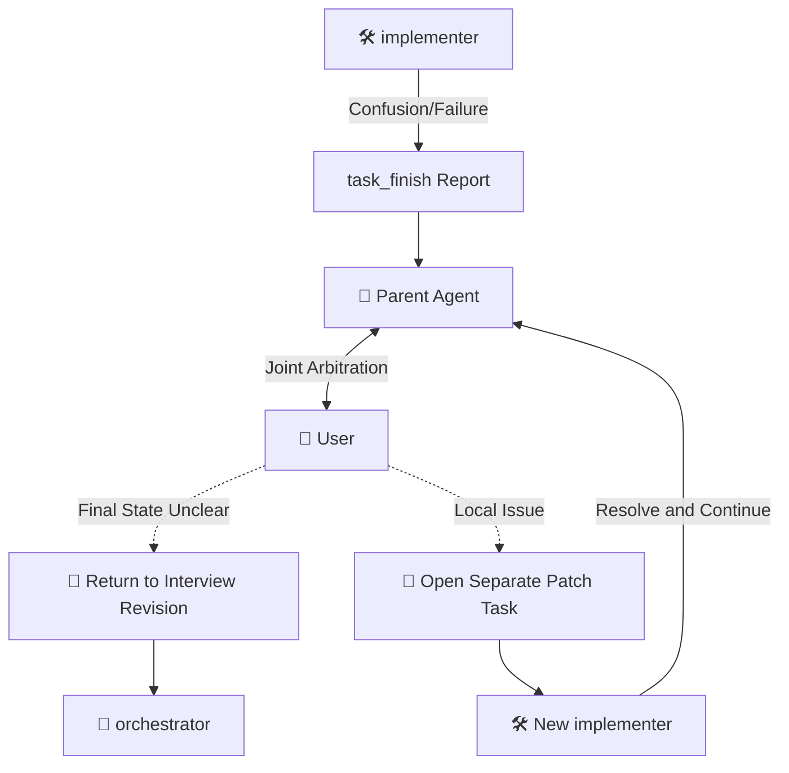

<!-- LOGO & HEADER SECTION -->
<div align="center">

  <h1>🥳 Mutsumi</h1>
  
  <p><strong>Multi-Agent Notebook Environment for VS Code</strong></p>
  
  <!-- TODO: Add Shields.io badges here -->
  <!--
  [](https://marketplace.visualstudio.com/items?itemName=MalachiteN.mutsumi)
  -->
  [](LICENSE)
  [](https://code.visualstudio.com/)
</div>

[中文版](README_zh.md)

Mutsumi is a VS Code LLM multi-Agent extension that emphasizes user in the loop, with Agents that can collaborate, be observed, interrupted, and corrected. It is committed to complete control over the context space, keeping LLM attention always focused on what matters to prevent generation quality degradation. It is also designed with consideration for minimizing API call counts and Token consumption. All Agent sessions are transparent plain-text documents, version-controllable and auditable.



---

## ✨ Core Features

### 📝 Native Notebook Experience

Say goodbye to traditional sidebar conversations. Mutsumi leverages **NotebookSerializer**:



- **VS Code Editor Panes** — Agent conversation pages as Notebook Editors for `.mtm` files, opening side-by-side with other files
- **Flexible Window Layouts** — Supports split-screen and multiple windows for free workspace organization
- **Persistent Sessions** — Conversation history persisted to Notebook data, manageable with git, shareable, and allowing state restoration anytime

### Tool Invocation and File Reference Pre-execution

When the user knows the LLM will inevitably need certain file content or tool execution results, tools can be pre-executed or files referenced, inserting results into ghost blocks in the context. This saves the LLM from wasting precious context budget reasoning about needed tool calls, and wasting valuable API quota repeatedly sending conversation history.


```markdown
@[src/main.ts]                      ← Reference file
@[src/utils.ts:10:20]               ← Reference specific line range
@[read_file{"uri": "path/to/file"}] ← Pre-execute tool
```

Context middleware tracks the latest version and hash of referenced files. If the hash is unchanged from the latest version, a command is injected for the Agent to trace back through historical records; if the hash changes, the latest file content is injected and version bumped.

Rules or referenced files can also recursively insert files or pre-execute tools using the `@[]` schema. For example, [our default Rules file](assets/default.md).

### 🛠️ Preprocessor and Macro Support

Referenced files and Rules support **preprocessor commands**.

Users define macros using statements like `@{define macro_name, value}`, and can then invoke files containing preprocessor commands:

```markdown
<!-- @ifdef xxx -->
If macro xxx is defined, this line will be visible to the Agent
<!-- @endif -->
```

This project uses the [`preprocess`](https://github.com/jsoverson/preprocess) library for powerful preprocessing capabilities.

### 🔍 Observability

Before sending conversation history to OpenAI Compatible endpoints, you can preview the assembled content in advance—no need to wait until Tokens have been spent generating low-quality content before discovering context assembly errors.


Similarly, you can also preview RAG search results in advance.

### 🌘 Multi-Theme Compatibility

Compatible with both dark and light themes, with bubble background colors changing automatically:


### 🌐 Native Multi-Workspace Support

Almost all tool operations natively support **multi-workspace**:



Compatible workspace types include but are not limited to:

- Multi-root workspaces
- Special schemas from other extensions' `FileSystemProvider`
- Any virtual file system supporting read/write

### 🔓 Unlock Unlimited Capabilities

Compatible with Anthropic's proposed Skills mechanism, and beyond.



It automatically reads:

- `SKILL.md` files under `~/.agents/skills/*/` in your **home directory**
- `SKILL.md` files under `.agents/skills/*/` in **each** workspace root of the current multi-root workspace

to register Skills.

### 🥳 Parent-Child Agent Paradigm

Unlike traditional single-conversation long-dialogue modes, Mutsumi implements a **multi-Agent collaboration** system:


- **Task Decomposition Capability** — Break complex tasks into multiple sub-tasks, processed in parallel by sub-Agents
- **Prevent Attention Dilution** — Avoid generation quality degradation caused by Softmax over long context in single sessions
- **Sidebar Dispatch Center** — Centralized management of all Agent sessions through the sidebar
- **Controllability and Auditability** — Requires approval to start, editable Prompts, can be interrupted, can be corrected through conversation

### 🤖 AgentType Role System

Mutsumi includes five default roles with clear responsibility boundaries:

| Role | Responsibility | Forkable Sub-roles |
|------|----------------|--------------------|
| **chat** | Pure chat entry point, does not enter the engineering execution tree | — |
| **orchestrator** | Global task convergence and dispatch center, interviews users, produces final state documents, and dispatches execution | planner / implementer / reviewer |
| **planner** | Milestone and dependency planner, identifies intermediate states and parallel/serial relationships | reviewer |
| **implementer** | Concrete engineering implementer, writes code, validates implementations, and integrates sub-results | implementer / reviewer |
| **reviewer** | Pure auditor, read-only review of outputs, adopts pass/conditional pass/fail three-state conclusion | — |

**Collaboration Topology:** Each preset role has decision-making and task advancement capabilities, avoiding information compression loss in hierarchical tree reporting structures.

**Custom Workflows:** Define role toolsets through `.mutsumi/config.json`, and customize role Prompts through `.mutsumi/rules/default/*.md`, fully controlling multi-Agent collaboration behavior.

> Detailed design is shown in [Agent Type System Design](docs/AGENT_TYPES_DESIGN.md) and [Prompt Engineering Design](docs/PROMPT_ENGINEERING_DESIGN.md)

---

## 👤 Typical User Journeys

### Small Task Direct Implementation

For requirements with minimal changes and clear goals, users can directly create an `implementer`:



**Interaction Details:**
- Use `@[src/main.ts]` to pre-insert code references, reducing LLM reasoning calls
- Use `@[search_file{"keyword": "xxx"}]` to pre-execute searches, quickly locating relevant code
- Use the **Copy Mutsumi Reference** context menu to quickly copy file/symbol references

If the requirement is clearly too large or uncertain, `implementer` should suggest the user switch to the `orchestrator` workflow.

### Large Task Convergence Before Execution

For complex feature development, refactoring, or design tasks:



`orchestrator` is responsible for interviewing users, converging requirements, producing final state documents, and optionally introducing `planner` for detailed planning before phased dispatching of `implementer` execution.

### Execution Failure Feedback Loop

When sub-Agents encounter blocking points they cannot continue:



- Sub-Agents report confusion or failure reasons via `task_finish`
- Parent Agent and user jointly arbitrate the root cause
- If the final state document is insufficient, return to the interview revision stage
- If it's just a local implementation issue, open a narrower task to patch and continue

### Key Interaction Mechanisms

| Mechanism | Usage | Effect |
|-----------|-------|--------|
| **@ Schema Reference** | `@[src/main.ts:10:50]` | Precisely reference code snippets |
| **Tool Pre-execution** | `@[search_file{"keyword": "xxx"}]` | Pre-execute search, inject results into context |
| **Copy Mutsumi Reference** | Context Menu | Quickly copy file/symbol @ reference format |
| **Dynamic Context Tracking** | Automatic version hash | Reference history when files unchanged, inject new version when changed |

---

## 🚀 Quick Start

### Installation

```bash
# Build from source
npm install
vsce package

# Install locally to VS Code
code --install-extension mutsumi-[version].vsix
```

### Configuration

If you use your own proxy API, configure `mutsumi.apiKey`, `mutsumi.baseUrl`, etc. in VS Code settings to start using. Note that you may need to override the default `mutsumi.models` object.

However, this Agent framework is specifically designed and optimized around the Kimi K2.5 base model. It is recommended to use [zenmux](https://zenmux.ai) aggregation platform or [Kimi Open Platform](https://platform.moonshot.cn/) to use Kimi K2.5.

### Create Your First Agent

1. Press Ctrl+Shift+P to open the Command Palette
2. Click **Mutsumi: New Agent** to create a new session
3. Start the conversation in the `.mtm` notebook file
4. Use the `@[file_path]` syntax to reference code files

---

## 🛠️ Built-in Tools

Mutsumi provides rich built-in tools for intelligent task execution:

- **File Operations** — `read_file`, `edit_file`, `create_file`, `ls`, `get_file_size`
- **Code Search** — `search_file_contains_keyword`, `search_file_name_includes`, `project_outline`, `query_codebase`
- **Execution Control** — `shell`, `get_env_var`, `system_info`
- **File Editing** — `edit_file_search_replace`, `edit_file_full_replace`
- **Agent Orchestration** — `self_fork`, `get_available_models`, `task_finish`

---

## 📝 Dynamic Context Technology Deep Dive

Mutsumi adopts a six-phase dynamic context management architecture:

1. Environment and Macro Initialization — Load persisted context state and macro definitions
2. System Prompt Construction — Integrate Rules and runtime environment
3. User Input Parsing — TemplateEngine recursively processes file references
4. Incremental Snapshots and Version Control — Intelligent change detection to save Tokens
5. Persistence and Metadata Update — Save ghost blocks to Cell Metadata
6. Final Message Assembly — Consistent prefix to maximize LLM KV Cache utilization

### Recursive File Reference and Tool Pre-execution Parsing

Using the `@[path]` syntax, the TemplateEngine recursively parses nested references and pre-executes tool calls:

```
User Input: "Read @[doc/main.md]"
    ↓
Discover @[doc/main.md] → Read file, run preprocessor
    ↓
Discover internal reference @[doc/utils.md] → Recursively parse
    ↓
Return expanded complete content (main.md already contains utils.md)
    ↓
Discover included @[ls{"uri": "path/to/codebase"}] → Pre-execute tool
```

**APPEND Mode** (top-level): Content collected into ghost blocks  
**INLINE Mode** (recursive layers): Content directly replaces original tags and embeds into parent file

### Ghost Block Structure

````markdown
<content_reference>
The following are files referenced by the user via @ (or their latest version status):

# Source: src/utils.ts (v1)
> Content unchanged. See previous version (v1).

# Source: src/new-feature.ts (v2)
```typescript
... (complete new content) ...
```
</content_reference>
````

### Macro Lifecycle

- **Definition**: `@{define KEY, VALUE}`
- **Scope**: Affects Prompts, file paths, file content, and tool parameters spatially
- **Persistence**: Written to Notebook Metadata, permanently effective across rounds

---

## 🙏 Credits

This project uses the following open source projects and their license declarations:

### Core Dependencies

| Project | Version | License | Purpose |
|---------|---------|---------|---------|
| [openai](https://github.com/openai/openai-node) | ^6.17.0 | Apache-2.0 | OpenAI API client |
| [better-sqlite3](https://github.com/WiseLibs/better-sqlite3) | ^12.8.0 | MIT | SQLite database engine |
| [sqlite-vec](https://github.com/asg017/sqlite-vec) | ^0.1.7-alpha.2 | MIT | SQLite vector extension for RAG |
| [diff](https://github.com/kpdecker/jsdiff) | ^8.0.3 | BSD-3-Clause | Text diff comparison |
| [gray-matter](https://github.com/jonschlinkert/gray-matter) | ^4.0.3 | MIT | Markdown metadata parsing |
| [preprocess](https://github.com/jsoverson/preprocess) | ^3.2.0 | Apache-2.0 | File preprocessor macros |
| [uuid](https://github.com/uuidjs/uuid) | ^9.0.1 | MIT | UUID generation |
| [web-tree-sitter](https://github.com/tree-sitter/tree-sitter) | ^0.22.2 | MIT | Syntax tree parsing |

Thanks to all open source contributors! 🙏

---

## 📄 License

This project is licensed under [Apache License 2.0](LICENSE).

---

<p align="center">
  Made with ❤️ by <a href="https://github.com/MalachiteN">MalachiteN</a>
</p>
