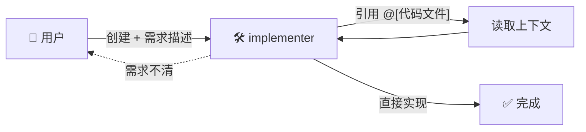
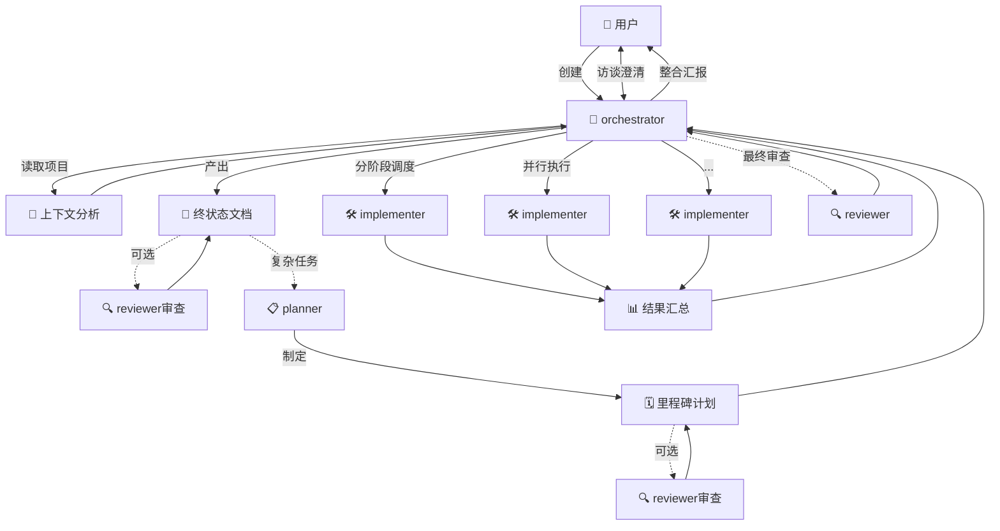
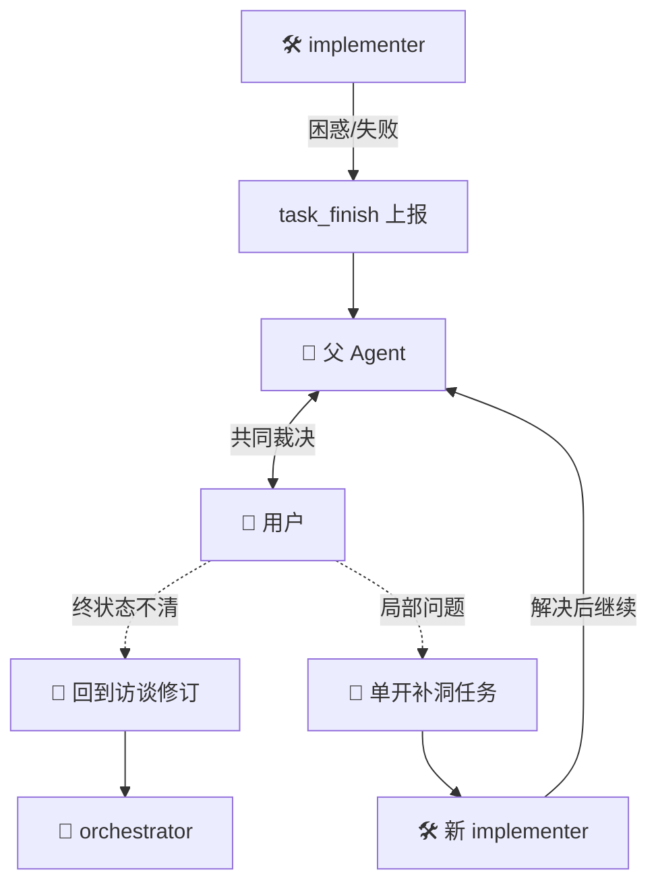

<!-- LOGO & HEADER SECTION -->
<div align="center">

  <h1>🥳 Mutsumi</h1>
  
  <p><strong>VS Code 多 Agent 笔记本环境</strong></p>
  
  <!-- TODO: 在此处添加 Shields.io 徽章 -->
  <!--
  [](https://marketplace.visualstudio.com/items?itemName=MalachiteN.mutsumi)
  -->
  [](LICENSE)
  [](https://code.visualstudio.com/)
</div>

[English](README.md)

Mutsumi 是一款 VS Code LLM 多 Agent 插件，强调用户在回路中，Agent 可协作、可观察、可打断、可纠偏；致力于对上下文空间的完全掌控，让 LLM 的注意力始终聚焦于关键之处，防止生成质量下降。设计上，也考虑到了对 API 调用次数、Tokens 消耗的尽量节省。所有 Agent 会话都是透明的纯文本文档，可控制版本、可审计。


---

## ✨ 核心特性

### 📝 Notebook 原生体验

告别传统侧边栏对话，Mutsumi 利用 **NotebookSerializer**：


- **VSCode 编辑器窗格** — Agent 对话页面作为 `.mtm` 文件的 Notebook Editor，与其他文件并排打开
- **灵活窗口布局** — 支持分屏、多窗口，自由组织工作空间
- **持久化会话** — 对话历史持久化到 Notebook 数据，可用 git 管理，可分享，可随时恢复工作状态

### 工具调用与文件引用预执行

当用户已知 LLM 必然需要某段文件内容或工具执行结果时，可以预先执行工具调用或文件引用，将结果插入上下文的幽灵块中，令 LLM 不必浪费宝贵的上下文预算来推理出自己需要调用工具，再浪费宝贵的 API 额度去反复发送会话历史记录。


```markdown
@[src/main.ts]                      ← 引用文件
@[src/utils.ts:10:20]               ← 引用指定行数
@[read_file{"uri": "path/to/file"}] ← 预执行工具
```

上下文中间件会保持跟踪被引文件的最新版本及其哈希。若哈希相比最新版本未变，则会注入一条让 Agent 回溯历史记录的命令；哈希变化，则会注入最新版本文件内容，并 bump version。

Rules 或被引文件也可以使用 @[] schema 递归插入文件或预执行工具。例如 [我们的默认 Rules 文件](assets/default/implementer.md)。

### 🛠️ 预处理器与宏支持

引用文件、Rules 支持**预处理器命令**。

用户使用 `@{define 宏名, 值}` 一类的语句定义宏，然后可调用如下包含预处理器命令的文件：

```markdown
<!-- @ifdef xxx -->
如果定义了宏xxx，那么这一行将对Agent可见
<!-- @endif -->
```

本项目使用 [`preprocess`](https://github.com/jsoverson/preprocess) 库实现强大的预处理能力。

### 🔍 可观测性

在发送会话历史记录到 OpenAI Compatible 端点之前，就可以预先查看待发送内容的装配结果，不用等到已花费 Tokens 生成了低质量内容才发现上下文组装失误。


同样的，也可以预先查看 RAG 搜索的结果。

### 🌘 多主题颜色兼容

兼容深色主题和浅色主题，气泡底纹颜色自动变化：


### 🌐 多工作区原生支持

几乎所有工具操作都原生支持**多工作区**：


兼容的工作区类型包括但不限于：

- 多根工作区
- 其他插件的 `FileSystemProvider` 特殊 schema
- 任何支持读写的虚拟文件系统

### 🔓 解锁无限能力

兼容 Anthropic 提出的 Skills 机制，而不止于此。


它会自动读取：

- 你的**家目录**下的 `.agents/skills/*/SKILL.md`
- 当前多根工作区下的**每个**工作区根目录下的 `.agents/skills/*/SKILL.md`

来注册 Skills。

### 🥳 子母 Agent 范式

不同于传统单对话流的长对话模式，Mutsumi 实现了**多 Agent 协作**系统：


- **任务分治能力** — 将复杂任务分解为多个子任务，由子 Agent 并行处理
- **避免注意力稀释** — 防止单一会话长上下文 Softmax 导致的生成质量降低
- **边栏调度中心** — 通过侧边栏集中管理所有 Agent 会话
- **可控与可审计性** — 需审批启动，可编辑 Prompt，可打断，可对话更正

### 🤖 AgentType 角色系统

Mutsumi 内置五种默认角色，每种都有清晰的职责边界：

| 角色 | 职责 | 可 Fork 子角色 |
|------|------|----------------|
| **chat** | 纯闲聊入口，不进入工程执行树 | — |
| **orchestrator** | 全局任务收敛与调度中心，访谈用户、产出终状态文档、调度执行 | planner / implementer / reviewer |
| **planner** | 里程碑与依赖计划设计者，识别中间状态与并行/串行关系 | reviewer |
| **implementer** | 具体工程实现者，编写代码、验证实现、整合子结果 | implementer / reviewer |
| **reviewer** | 纯审计者，只读审查产出，采用 pass/conditional pass/fail 三态结论 | — |

**协作拓扑：** 每个预设角色都拥有决策和推进任务的能力，避免信息在树形回报结构中层层压缩损耗。

**自定义工作流：** 通过 `.mutsumi/config.json` 定义角色工具集，通过 `.mutsumi/rules/default/*.md` 自定义角色 Prompt，完全掌控多 Agent 协作行为。

> 详细设计见 [Agent Type 系统设计](docs/AGENT_TYPES_DESIGN_CN.md) 和 [Prompt Engineering 设计](docs/PROMPT_ENGINEERING_DESIGN_CN.md)

---

## 👤 典型用户旅程

### 小任务直接实现

对于改动很小、目标清晰的需求，用户可直接创建 `implementer`：



**交互细节：**
- 使用 `@[src/main.ts]` 预插入代码引用，减少 LLM 推理调用
- 使用 `@[search_file{"keyword": "xxx"}]` 预执行搜索，快速定位相关代码
- 通过 **Copy Mutsumi Reference** 右键菜单快速复制文件/符号引用

若需求明显过大或不确定，`implementer` 应建议用户改走 `orchestrator` 流程。

### 大任务收敛再执行

对于复杂功能开发、重构或设计任务：



`orchestrator` 负责采访用户、收敛需求、产出终状态文档，再视情况引入 `planner` 做详细计划，最后分阶段调度 `implementer` 执行。

### 执行失败的回路

当子 Agent 遇到无法继续的阻塞点时：



- 子 Agent 通过 `task_finish` 上报困惑或失败原因
- 父 Agent 与用户共同裁决问题根源
- 若终状态文档不充分，回到访谈修订阶段
- 若只是局部实现问题，单开更窄的任务补洞后继续

### 关键交互机制

| 机制 | 用法 | 效果 |
|------|------|------|
| **@ Schema 引用** | `@[src/main.ts:10:50]` | 精确引用代码片段 |
| **工具预执行** | `@[search_file{"keyword": "xxx"}]` | 预执行搜索，结果注入上下文 |
| **Copy Mutsumi Reference** | 右键菜单 | 快速复制文件/符号的 @ 引用格式 |
| **动态上下文追踪** | 自动版本哈希 | 文件未变时引用历史，变化时注入新版本 |

---

## 🚀 快速开始

### 安装

```bash
# 从源码构建
npm install
vsce package

# 本地安装到 VS Code
code --install-extension mutsumi-【版本号】.vsix
```

### 配置

Mutsumi 默认使用 `kimi-for-coding` 模型。你只需在 VS Code 设置中填入 API Key 即可开始使用。

打开 `settings.json`，添加：

```json
"mutsumi.providers": [
    {
        "name": "kimi-for-coding",
        "baseurl": "https://api.kimi.com/coding/v1",
        "api_key": "sk-kimi-XXXXXXXXXXXXXXXXXXXXXX"
    }
]
```

如需使用其他模型或服务商，可相应配置 `mutsumi.providers` 和 `mutsumi.models`，具体示例请参见 VS Code 设置中的说明。

> **注意：** 本 Agent 框架针对 Kimi 基模家族调性优化设计，强烈建议使用 `kimi-for-coding`。

### 创建第一个 Agent

1. 按 Ctrl+Shift+P 打开命令面板
2. 点击 **Mutsumi: New Agent** 创建新会话
3. 在 `.mtm` 笔记本文件中开始对话
4. 使用 `@[文件路径]` 语法引用代码文件

---

## 🛠️ 内置工具

Mutsumi 提供丰富的内置工具，支持智能任务执行：

- **文件操作** — `read_file`, `edit_file`, `create_file`, `ls`, `get_file_size`
- **代码搜索** — `search_file_contains_keyword`, `search_file_name_includes`, `project_outline`, `query_codebase`
- **执行控制** — `shell`, `get_env_var`, `system_info`
- **文件编辑** — `edit_file_search_replace`, `create_or_replace`
- **Agent 编排** — `dispatch_subagents`, `get_available_models`, `task_finish`

---

## 📝 动态上下文技术详解

Mutsumi 采用六阶段动态上下文管理架构：

1. 环境与宏初始化 — 加载持久化的上下文状态和宏定义
2. System Prompt 构建 — 集成 Rules 和运行时环境
3. 用户输入解析 — TemplateEngine 递归处理文件引用
4. 增量快照与版本控制 — 智能检测变更，节省 Token
5. 持久化与元数据更新 — 保存幽灵块到 Cell Metadata
6. 最终消息组装 — 前缀一致，最大化利用 LLM 的 KV Cache

### 递归文件引用与工具预执行的解析

使用 `@[路径]` 语法，TemplateEngine 会递归解析嵌套引用，并预执行工具调用：

```
用户输入: "阅读 @[doc/main.md]"
    ↓
发现 @[doc/main.md] → 读取文件、运行预处理器
    ↓
发现内部引用 @[doc/utils.md] → 递归解析
    ↓
返回展开后的完整内容（main.md 已包含 utils.md）
    ↓
发现其中包括的 @[ls{"uri": "path/to/codebase"}] → 预执行工具
```

**APPEND 模式**（顶层）：内容收集到幽灵块  
**INLINE 模式**（递归层）：内容直接替换原标签嵌入父文件

### 幽灵块（Ghost Block）结构

````markdown
<content_reference>
以下是用户使用@引用的文件（或其最新版本状态）：

# Source: src/utils.ts (v1)
> Content unchanged. See previous version (v1).

# Source: src/new-feature.ts (v2)
```typescript
... (完整的新内容) ...
```
</content_reference>
````

### 宏的生命周期

- **定义**：`@{define KEY, VALUE}`
- **作用域**：空间上影响 Prompt、文件路径、文件内容、工具参数
- **持久化**：写入 Notebook Metadata，跨轮次永久有效

---

## 🙏 Credits

本项目使用以下开源项目及其许可证声明：

### 核心依赖

| 项目 | 版本 | 许可证 | 用途 |
|------|------|--------|------|
| [openai](https://github.com/openai/openai-node) | ^6.17.0 | Apache-2.0 | OpenAI API 客户端 |
| [better-sqlite3](https://github.com/WiseLibs/better-sqlite3) | ^12.8.0 | MIT | SQLite 数据库引擎 |
| [sqlite-vec](https://github.com/asg017/sqlite-vec) | ^0.1.7-alpha.2 | MIT | SQLite 向量扩展，用于 RAG |
| [diff](https://github.com/kpdecker/jsdiff) | ^8.0.3 | BSD-3-Clause | 文本差异对比 |
| [gray-matter](https://github.com/jonschlinkert/gray-matter) | ^4.0.3 | MIT | Markdown 元数据解析 |
| [preprocess](https://github.com/jsoverson/preprocess) | ^3.2.0 | Apache-2.0 | 文件预处理器宏 |
| [uuid](https://github.com/uuidjs/uuid) | ^9.0.1 | MIT | UUID 生成 |
| [web-tree-sitter](https://github.com/tree-sitter/tree-sitter) | ^0.22.2 | MIT | 语法树解析 |

感谢所有开源贡献者！🙏

---

## 📄 许可证

本项目采用 [Apache License 2.0](LICENSE) 开源许可证。

---

<p align="center">
  Made with ❤️ by <a href="https://github.com/MalachiteN">MalachiteN</a>
</p>
